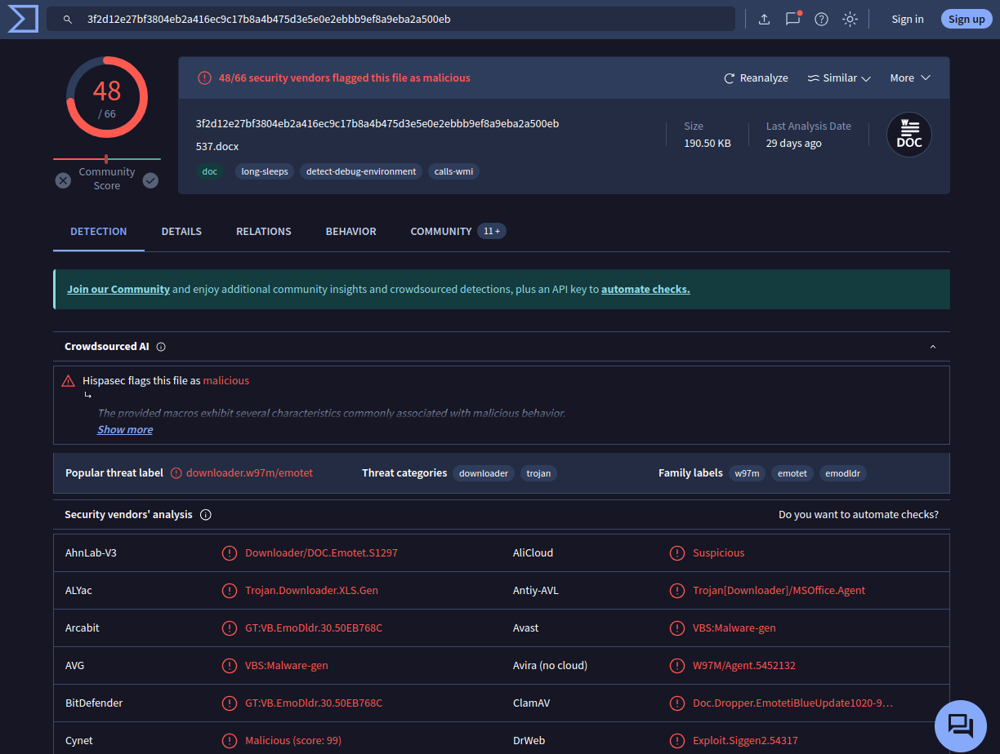
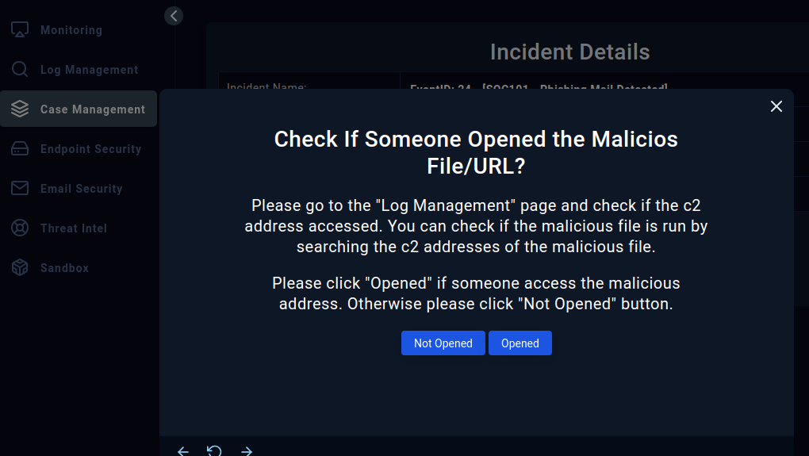

# Let's Defend: SOC101 - Phishing Mail Detected

## Alert

```
EventID : 24
Event Time : Oct, 25, 2020, 09:32 PM
Rule : SOC101 - Phishing Mail Detected
Level : Security Analyst
SMTP Address : 173.194.68.27
Source Address : darcy.downey@gmail.com
Destination Address : james@letsdefend.io
E-mail Subject : Covid-19 News!
Device Action : Blocked
```

## Case

So, we pick this up on the Main Channel taking ownership of the alert and create a case.

Move to `Case Management` and open the `EventID: 24 - [SOC101 - Phishing Mail Detected]` case to work on it.


Only one thing to do, hit that "Start playbook!" button!

## Playbook

The way Let's Defend (and most SOAR platforms work), you're not getting everything in a single interface. So I suggest that before you do anything, clone your tab!


We'll keep the `Case Management` area on the first and wander around on the second. So let's start that playbook!

First thing we're presented with in the Playbook phase is about parsing the email that triggered this alert.


So here we can do this in two ways: one, we can actually dig into the email and analyze it; or two, we can follow the playbook step by step to see it through.

I'll do two first, then I'll document how you can go through this instead of following the playbook.

## Parsing the email

The "Parse Email" asks us 6 things:

- When was it sent?

- What is the email's SMTP address?

- What is the sender address?

- What is the recipient address?

- Is the email content suspicious?

- Are there any attachment?

And we can already answer almost all of those from the alert itself! Event Time, SMTP address, source and address destination are all there. The last two questions we actually need to see the email on `Email Security` area (use that second tab!), and search for "Covid-19 News!" to find the correct email:


The two questions we need to answer here are: "Is the email content suspicious?" and "Are there any attachment?" - well we can already answer the last one: yes, we see an attachment there. And the "Open it now!" phrase in the email is already a pretty big red flag in answering the first one!


Yes, there is! Next playbook page? Analyzing Url/Attachment:


Saving the attachment locally, unzipping it using the password `infected`, we get its contents. The first thing I usually do is calculate the SHA256 of it:


And now, we check this `3f2d12e27bf3804eb2a416ec9c17b8a4b475d3e5e0e2ebbb9ef8a9eba2a500eb` hash for known IOCs on one of the suggested websites, like VirusTotal:

(AnyRun, URLHouse, URLScan and HybridAnalysis may also help in this one, why don't you check them out?)



What a surprise, huh? And with this we get the confirmation that this email content isn't only suspicious, it's actually malicious! 

- When was it sent?

    - Oct, 25, 2020, 09:32 PM

- What is the email's SMTP address?

    - 173.194.68.27

- What is the sender address?

    - darcy.downey@gmail.com

- What is the recipient address?

    - james@letsdefend.io

- Is the email content suspicious?

    - Yes.

- Are there any attachment?

    - Yes.

Next playbook page: "Check if Mail Delivered to User?"


As the description tells us, we need to look at the "device action" part of the alert details... but that doesn't sound quite right? If we go back to the alert details on `Monitoring` area, we'll see that `Device Action` says "Blocked":


(never mind that "re-investigated" orange thing in the screen capture, I'm writing this write-up years after the first time I've done this case! =p )

But if we look back to the email details...


We see that it says "Action: Allowed". What a pickle! Let's stick to what we're seeing: the `Email Security` area says it's been allowed, so we'll go with "Delivered".

Next up, the playbook gives us a single action: delete the email from recipient! Go! Delete it!


Next up, the playbook takes us to a new area: `Log Management`!



Once again we go to the second tab, so we can leave the playbook where it is.

But what are we searching for? Let's go back to VirusTotal (or any of the other tools you've used - take this opportunity to explore it!) and check it's relations tab!


Quite a few URL and IPs with malcious IOCs detections, quite a few. But none of those will have a match, because...? The `doc` file isn't the one calling the shots. "But Johnny, how do we know that?" - let's take a step back: go back to the `Detection` tab and see what we're dealing with:


Oh great, Emotet. Now we reach the point where we realize that most of the time a single tool isn't enough for a good investigation - VT gets as far as telling us that this `doc` writes a second (among other) file called `C:\Users\Admin\P6a8_bp\Kmkgltv\Azrn_u9q.exe`, but leaves us hanging there - no hash, no links to it, nothing.

Enters AnyRun! To be more precise (because it can be kinda hard to find at first), we need the Public Malware Submission part of AnyRun, at https://app.any.run/submissions/:


We could submit our file, but let's think about a realistic scenario: do we want to submit to a public search engine something that could have been tailored to our (or our client's) environment? (if the hash fits, it means it's not tailored and/or someone else already submitted before)

This way, we can check the results. Or we could try Hybrid-Analysis:


Either way, we need to remember one thing: malware usually is made in such a way as to identify if it's being run in a VM... so it won't always trigger its payload! In Hybrid Analysis, the one that contains the triggered payload is [this one](https://www.hybrid-analysis.com/sample/3f2d12e27bf3804eb2a416ec9c17b8a4b475d3e5e0e2ebbb9ef8a9eba2a500eb/5f99f7145b27a34ae23c038f), while the AnyRun submission that fits the case would be [this one](https://app.any.run/tasks/bb6c540e-b217-401c-a5b2-86a60b9fdc99/)... but there could be others! Can you find any other submission on any of these of other tools?

And you dig. And you dig. And you finally find out the C2 IP address of: 24.178.90.49


(Anyrun's indication of C2)

YEY!

But remember, all that glitters is NOT gold. Sometimes, things work. Things like EDRs and firewalls. Remember what we had to do? Check the `Log Management` area to see if the C2 address was accessed. So, was it?


Nothing, huh? So, I'd say something worked out right around here. Either the attachment was blocked or EDR prevented the malicious code execution... we need to deal with what we're looking at. The question tells you: 

> Please click "Opened" if someone access the malicious address. Otherwise please click "Not Opened" button.

Since we can't find any evidence that the C2 was accessed, we're going with "Not Opened".

We are then asked to register artifacts related to this alert and case:


The types of artifacts expected are: URL address, e-mail sender, e-mail domain, IP address and MD5 Hash.

We're dealing with an e-mail with an attachment, but with no links in its body, so no URL addresses of importance here.

- E-mail sender would be `darcy.downey@gmail.com`

- E-mail domain would be `gmail.com`

- IP address of importance here is the C2 one, so `24.178.90.49`

- MD5 Hash of importance here are both the attachment `3f2d12e27bf3804eb2a416ec9c17b8a4b475d3e5e0e2ebbb9ef8a9eba2a500eb` and the payload... oh, we forgot to document that one, right?

Let's get back on AnyRun's submission:


And so, the second hash of importance is `079a40e85a1cddff1c1a26a95b8dd1e6fc4513f08f64d3ba223b5552a4662243`.


One thing of note in this: click the `+` button up top of the modal to add new fields, the `Next` button will take you to the next step ;)

## Wrapping up


Here's where you put your conclusions for the case. What's your take on this one? 

Mine is this: the attachment was blocked and denied execution, which prevented the malicious code from being deployed and reaching out to the C2 server.

Remember I said this is a re-investigation? This is how I wrapped up this exercise in my previous run:


I wonder if I'll measure up to it...? 


Remember to go back to the `Monitoring` area and close the alert.


Hmmmm looks like I've got something wrong this time:


Can you identify what was different that cost me 10 points (from +5 to -5) this time?

You got it yet?

Remember what we went thru. Scroll back, if you need... take your time.

Remember that pickle?

Yeah, the alert on `Monitoring` says one thing, and the `Email Security` says another one. Remember to always stick to what you're being asked about - there may be times when you're absolutely sure you're right and the question is wrong... But that can still cost you some points ;)

Thank you for the great exercise, Let's Defend!